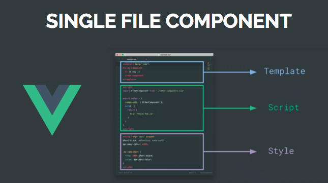
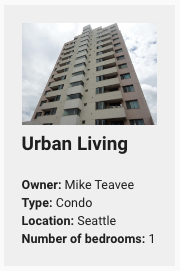

# Componentes

Componentes implementam e encapsulam comportamentos específicos de uma aplicação. Estrategicamente os componentes devem ser projetados para funcionar isoladamente, recebendo apenas parâmetros que determinam seu comportamento. Desta forma, estes funcionam de forma desacoplada e são reutilizáveis em toda a aplicação.

::: tip
Os componentes são armazenados na pasta `/components` .
:::

## Single File Components

Este conceito é introduzido pelo **Vue**, onde estabelece que a implementação do componente é autocontida e desacoplada. O mesmo arquivo contém defininções de template \(html\), comportamento \(javascript\) e estilo \(css\).



Pontos chaves na concepção de um componente:

* **São reutilizáveis**
* Deve funcionar isoladamente 
* É desacoplado da aplicação
* Não realiza chamadas ao backend
* Os dados necessários são recebidos via parâmetros

## Componente "Imovel.vue"

O componente `components/Imovel.vue` é reponsável apenas por exibir a miniatura de um imóvel. Este é desacoplado da aplicação e reutilizável, recebendo apenas como parâmetro um objeto javascript que representa um imóvel.

```json
let meuImovel = {
    "id": 1,
    "title": "Grand Mansion",
    "owner": "Veruca Salt",
    "city": "San Francisco",
    "bedrooms": 15
}
```

```vue
<imovel :imovel="meuImovel"></imovel>
```



Código do componente `components/Imovel.vue:`

```vue
<template>
  <div class="bloco">
    
    <h2>{{ imovel.title }}</h2>
    <br>
    <div>
      <strong>Owner:</strong> {{imovel.owner}}
    </div>
    <div>
      <strong>City:</strong> {{imovel.city}}
    </div>
    <div>
      <strong>Bedrooms:</strong> {{imovel.bedrooms}}
    </div>
  </div>
</template>

<script>
  export default {
    // declara quais as propriedades recebidas pelo componente
    props: ['imovel']
  }
</script>

<style scoped>
  .bloco {
    background: #efefef;
    margin: 20px;
    padding: 20px;
    float: left;
  }

  .bloco img {
    max-height: 100px;
  }
</style>
```

É possível definir globalmente estilos aplicados a todos os componentes \(em `nuxt.config.js`\). Os estilos específicos contidos em um componente são aplicados somente a este e sobrescrevem o estilo global.

