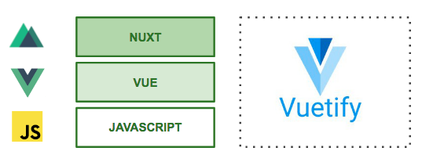

# Introdução

Este manual descreve a solução arquitetural proposta para construção de Single Page Applications \(SPAs\) baseadas no framework **Vue** e tecnologias correlatas. Nos capítulos seguintes serão introduzidos conceitos  básicos de cada framework e um passo-a-passo para construção da primeira aplicação.

As informações contidas aqui são uma compilação das documentações oficiais dos frameworks descritos, de forma simplificada, com o intuito de introduzir na prática o entendimento das tecnologias.

::: tip Código fonte do projeto 
[https://github.com/robsontenorio/imoveis-app](https://github.com/robsontenorio/imoveis-app)
:::

## Vue

Vue \(pronuncia-se /vjuː/, como **view**, em inglês\) é um **framework progressivo **para a construção de interfaces de usuário. Ao contrário de outros _frameworks monolíticos_, Vue foi projetado desde sua concepção para ser adotável incrementalmente. A biblioteca principal é focada exclusivamente na camada visual \(_view layer_\), sendo fácil adotar e integrar com outras bibliotecas ou projetos existentes.

:::tip Documentação oficial 
[https://br.vuejs.org/v2/guide/index.html](https://br.vuejs.org/v2/guide/index.html)
:::

## Nuxt

Nuxt é um framework construído sobre o Vue. Você pode criar aplicações universais \(redenrizadas do lado do servidor\) ou Single Page Applications \(SPA\) rapidamente com configuração mínima. O Nuxt proporciona um conjunto de abstrações e facilidades, simplificando e acelerando o desenvolvimento de aplicações Vue.

:::tip Documentação oficial 
[https://nuxtjs.org](https://nuxtjs.org)
:::

## Vuetify

Vuetify é um framework de componentes estilizados baseados na especificação "Material Design" do Google. Cada componente é projetado para trazer o melhor sobre usabilidade e experiência de usuário.

:::tip Documentação oficial 
[https://vuetifyjs.com](https://vuetifyjs.com)
:::

## Arquitetura

O resultado obtido pela combinação de tecnologias proporciona flexibilidade e agilidade no processo de desenvolvimento de aplicações.

O estilo arquitetural e filosofia de desenvolvimento é proposto pelo **Vue**, que traz o _core_ principal do conjunto de funcionalidades. Vue suporta ES5, ES6 e TypeScript.

Uma camada acima o **Nuxt** abstrai e simplifica uma série de configurações do ambiente de desenvolvimento, aproveitando-se das _features_ do Vue.

Complementarmente, o **Vuetify** adiciona um conjunto de componentes visuais estilizados, abstraindo o processo de construção de interface de usuário.

.