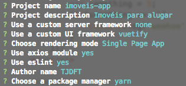
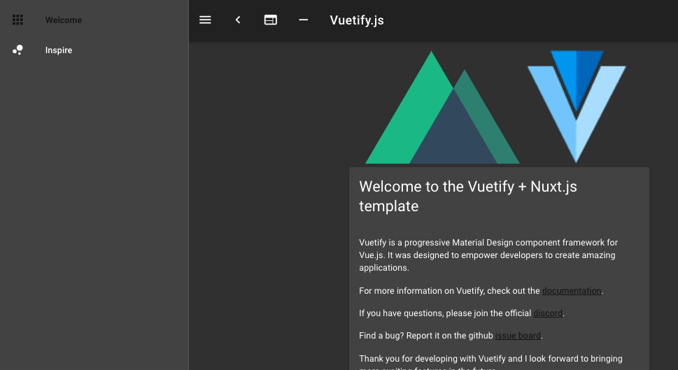

# Instalação

Considerando a arquitetura proposta, existem algumas formas de se iniciar um novo projeto baseado no CLI \(Command Line Interface\). Os resultados são semelhantes em todos os casos, com pequenas diferenças de configurações no aplicativo criado.

```bash
# usando CLI do Vue
vue init webpack meu-projeto

# usando CLI do Vue com template do Vuetify
vue init vuetifyjs/webpack meu-projeto

# usando CLI do Vue com template básico do Nuxt
vue init nuxt-community/starter-template meu-projeto
```

Entretanto, o setup inicial via **nuxt-app** é o mais recomendado, uma vez que a estrutura inicial gerada é mais simplificada, abstraindo uma série de configurações.

```bash
# usando CLI do Yarn com "nuxt-app"
yarn create nuxt-app meu-projeto
```

## Criando o projeto

Inicie um novo projeto utilizando `nuxt-app` via `yarn` :

```bash
yarn create nuxt-app imoveis-app
```

Escolha as seguintes opções:



O instalador oficial sugere usar `npm`, neste projeto vamos utilizar o `yarn`. Ao término da instalação dos pacotes execute:

```bash
# entrar na pasta do projeto
cd imoveis-app

# inicia a aplicação em modo de desenvolvimento
yarn dev
```

O projeto será compilado e iniciado em modo de desenvolvimento com _hot reload_ \(cada mudança de código é refletida automaticamente na aplicação\). Acesse no browser o endereço [**http://localhost:3000**](http://localhost:3000)



A instalação foi feita por meio de um template. Normalmente um template não atualiza constantemente as versões dos pacotes. Vamos atualizar para as versões mais recentes dos pacotes. Portanto, vamos parar o servidor \(ctrl + c\) e executar o seguinte comando.

```bash
yarn add nuxt vuetify @nuxtjs/axios
```

Automaticamente novas versões dos pacotes são atualizadas no arquivo package.json. Inicie novamente o servidor com `yarn dev` e atualize a página.

