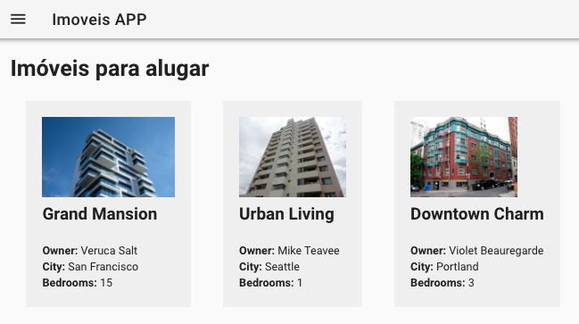
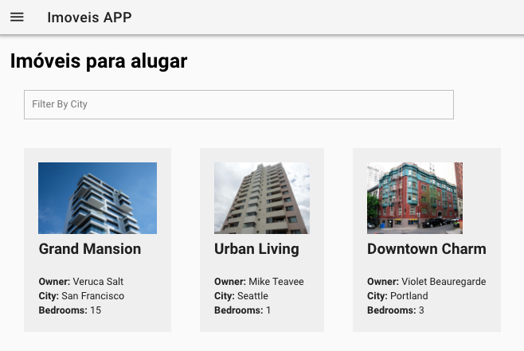

# Páginas

Uma página é um ponto de entrada da aplicação por meio de uma rota, conforme discutido no capítulo anterior. A página contém o setup inicial para preparar a exibição dos componentes contidos nesta.

::: tip
As páginas são armazenadas na pasta `/pages`
:::

Pontos chaves na concepção de uma página:

* **Não é reutilizável**
* Contém os componentes
* Contém elementos de interface adicionais, que não são encapsulados por componentes
* Realiza chamadas ao backend para trazer os dados consumidos pelos componentes

Uma página também é tratada como um componente Vue. Entretanto, devem ser utilizadas para a função proposta, conforme descrito.

## Página "imoveis.vue"

A página `pages/imoveis.vue` exibe uma lista de imóveis. De acordo com a estrutura definida ela responde pela URL  [http://localhost:3000/imoveis](http://localhost:3000/imoveis) .

A responsabilidade desta página é estruturar a interface básica de usuário, acomodando os componentes criados na aplicação. Além disso a página é responsável por recuperar os dados \(no backend\) a serem consumidos pelos componentes.



Código resumido de `pages/imoveis.vue`

```vue
<template>
  <div>
      ... template da página, inclusive aproveitando componentes reutilizáveis
  </div>
</template>

<script>
// importa os componentes necessários para esta página
import Imovel from '@/components/Imovel'

export default {

  // declara os componentes necessários para esta página
  components: { Imovel },

  // método especial que define o estado inicial de dados da página
  data () { ... },

  // método especial executado quando a página é criada
  mounted () {  ... },

  // declaração dos métodos 
  methods: {
    carregar () { ... }
  }
}
</script>

<style scoped>
 ... estilos personalizados da página ...
</style>
```

Código completo de `pages/imoveis.vue`

```vue
<template>
  <div>
    <h1>Imóveis para alugar</h1>

    <!-- utiliza o componente Imovel.vue para cada imóvel encontrado -->
    <imovel :imovel="meuImovel" v-for="meuImovel in imoveis" :key="meuImovel.id"></imovel>
  </div>
</template>

<script>
  import Imovel from '@/components/Imovel'

  export default {
    components: { Imovel },

    data () {
      return {
        imoveis: []
      }
    },

    mounted () {
      this.carregar()
    },

    methods: {
      carregar () {
        this.$axios.get('/imoveis').then(response => {
          this.imoveis = response.data
        })
      }
    }
  }
</script>

<style scoped>
  h1 {
    color: black;
  }
</style>
```

É possível definir globalmente estilos aplicados a todas as páginas \(em `nuxt.config.js`\). Os estilos específicos contidos em uma página são aplicados somente a esta e sobrescrevem o estilo global.

Os atributos de um componente **Vue** são reativos. Inicialmente `this.imoveis` é declarado  como um array vazio. Depois que os dados são carregados do backend e setados em `this.imoveis`, automaticamente o template detecta a mudança.

## Incluíndo o filtro de cidades



Vamos modificar o método `data()` para incluir o estado inicial do termo de pesquisa por cidades, que começa inicialmente vazio:

```js
data() {
  return {
    imoveis: [],
    termoPesquisa: null
  }
}
```

Em seguida vamos incluir um `input` para digitação do termo de pesquisa. Este elemento fica vinculado automaticamente ao dado declarado `termoPesquisa`, por meio da diretiva `v-model` . Ao digitar qualquer valor no `input` , internamente o dado `termoPesquisa` é atualizado automaticamente \(reativamente\).

```html
<input placeholder="Filter By City" v-model="termoPesquisa" @keyup="filtrar()" />
```

Adicionalmente, para cada tecla digitada o método `filtrar()` é disparado. Este é reponsável por consultar novamente o backend, passando como parâmetro o termo digitado \(que é atualizado reativamente\).

```js
filtrar() {
    this.carregar({ city: this.termoPesquisa })
}
```

O método `carregar()`  está sendo reaproveitado e deve ser modificado para incluir opcionalmente parâmetros a serem passados na requisição ao backend.

```js
carregar(params) {
  this.$axios.get('/imoveis', { params }).then(response => {
    this.imoveis = response.data
  })
}
```

Este é o código final de `pages/imoveis.vue`

```vue
<template>
  <div>
    <h1>Imóveis para alugar</h1>

    <input placeholder="Filter By City" v-model="termoPesquisa" @keyup="filtrar()" />

    <imovel :imovel="meuImovel" v-for="meuImovel in imoveis" :key="meuImovel.id"></imovel>
  </div>
</template>

<script>
  import Imovel from '@/components/Imovel'

  export default {

    components: { Imovel },

    data () {
      return {
        imoveis: [],
        termoPesquisa: null,
      }
    },
    mounted () {
      this.carregar()
    },
    methods: {
      carregar (params) {
        this.$axios.get('/imoveis', { params }).then(response => {
          this.imoveis = response.data
        })
      },
      filtrar () {
        this.carregar({ city: this.termoPesquisa })
      }
    }
  }
</script>

<style scoped>
  h1 {
    color: black;
  }

  input {
    padding: 10px;
    width: 600px;
    border: 1px #c0c0c0 solid;
    display: block;
    margin: 20px;
  }
</style>
```


