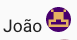
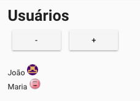
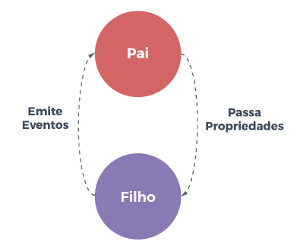
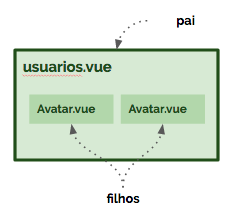
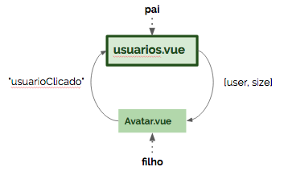

# Componentes

Como visto em capítulos anteriores o Vue é reativo. O que significa que uma propriedade  alterada reflete imediatamente em todos os pontos de referência quando utilizamos a diretiva `v-model` .

```html
<input v-model="nome">
```

```js
data(){
    return {
        nome: 'João'
    }
},
methods:
{
    saudar()
    {
        alert(this.nome)
    }   
}
```

Considere outro cenário em que existe um componente `components/Avatar.vue`, que recebe como parâmetros  `user` e  `size`.

```js
let usuario = {
    id: 1,
    nome: 'João',
    imagem: 'https://www.gravatar.com/avatar/00000000000000000000000000000000?d=retro&f=y'
}
```

```vue
<avatar size="50" user="usuario"></avatar>
```

Aqui teríamos como resultado um avatar renderizado para os parâmetros prefixados:



Código de`components/Avatar.vue`

```vue
<template>
  <span>
   {{ user.nome }}
    
  </span>
</template>
<script>
  export default {
    props: ['size', 'user']
  }
</script>
<style>
  img {
    border-radius: 50%;
  }
</style>
```

Considere que exista a página `pages/usuarios.vue` que lista cada usuário com seu respectivo avatar. Entretanto, aqui queremos controlar o tamanho do avatar dinamicamente por meio de botões. **O mesmo comportamento de reatividade se aplica também para componentes.**



```vue
<template>
  <div>
    <h1>Usuários</h1>

    <v-btn @click="diminuir()"> - </v-btn>
    <v-btn @click="aumentar()"> + </v-btn>

    <br><br>

    <div v-for="usuario in usuarios" :key="usuario.id">
      <avatar :size="tamanho" :user="usuario"></avatar>
    </div>
  </div>
</template>

<script>
  import Avatar from '@/components/Avatar'

  export default {
    components: { Avatar },
    data () {
      return {
        tamanho: 20,
        usuarios: [
          {
            id: 1,
            nome: 'João',
            imagem: 'https://www.gravatar.com/avatar/00000000000000000000000000000000?d=retro&f=y'
          },
          {
            id: 2,
            nome: 'Maria',
            imagem: 'https://www.gravatar.com/avatar/00000000000000000000000000000000?d=wavatar&f=y'
          }
        ]
      }
    },
    methods:
      {
        aumentar () {
          this.tamanho += 1
        },
        diminuir () {
          this.tamanho -= 1
        }
      }
  }
</script>
```

Observe que aqui os nomes dos attributos do componente avatar são precedidos por ":" \(dois-pontos\), indicando que os parâmetros do componente são recebidos dinâmicamente:

```vue
<avatar :size="tamanho" :user="usuario">
```

O valor de `tamanho` inicialmente é 20, obtido do método `data()` . Já o valor de `user` é obtido de cada objeto `usuario` no loop. Ao clicar nos botões "-" e "+", chamamos os métodos que modificam o valor do atributo `tamanho` , declarado previamente em `data()` , que por sua vez reflete automaticamente em todos os outros pontos.

## Propriedades para baixo, eventos para cima

No Vue projetamos cada componente para que funcione de forma desacoplada, permitindo sua reutilização. Assim, os componentes não conhecem a implementação um dos outros, apenas interfaces. No exemplo anterior, cada instância do componente `Avatar.vue` funciona exclusivamente baseada nos parâmetros passados pelo pai \(`pages/usuarios.vue`\).

Invariavelmente os componentes precisam se comunicar. O relacionamento pai-filho pode ser resumido como **propriedades para baixo, eventos para cima**. O pai passa dados para baixo por meio de **propriedades**, e o filho envia mensagens para o pai por meio de **eventos.**

|  |  |  |
| :--- | :--- | :--- |


### Filhos - components/Avatar.vue

Supondo que ao clicar na imagem qualquer uma das instâncias `Avatar.vue` \(filho\) gostariamos de destacar no topo da página `pages/usuarios.vue` \(pai\) o nome do usuário selecionado.  Neste cenário, nosso componente filho `Avatar.vue` precisa emitir um evento para notificar o interessado \(o pai\) `pages/suarios.vue` para que este implemente o comportamento desejado.

O código de `componentes/Avatar.vue` deve ser modificado para:

```vue
<template>
  <span>
    {{ user.nome }}
    
  </span>
</template>
<script>
  export default {
    props: ['size', 'user'],
    methods: {
      selecionado () {
        this.$emit('avatarClicado', this.user)
      }
    }
  }
  </script>
<style>
  img {
    border-radius: 50%;
  }
</style>
```

Ao clicar na imagem o método `selecionado()` é executado, que por sua vez emite um evento "para cima" com o nome `avatarClicado` e um determinado payload, que é o usuário `this.user` instanciado por este componente:

```js
this.$emit('avatarClicado', this.user)
```

### Pai - pages/usuarios.vue

O interessado neste evento \(o pai\) deve implementar o comportamento desejado. Vamos destacar no topo, caso exista, algum usuário selecionado:

```html
<h1>Usuários</h1>
<h2 v-if="usuarioSelecionado"> {{ usuarioSelecionado.nome }} </h2>
```

Vamos complementar `data()` adicionando o valor inicial de `usuarioSelecionado` como vazio:

```js
data() {
    return {
        usuarioSelecionado: null,
        ...
    }
}
```

No componente `<avatar>` vamos escutar por eventos com o nome `avatarClicado`, emitidos pelo próprio componente. Quando tal evento acontecer  dispararamos o método `destacarUsuario`.

```vue
<avatar :size="tamanho" :user="usuario" @avatarClicado="destacarUsuario"></avatar>
```

O método `destacarUsuario` automaticamente recebe o payload emitido pelo evento vindo do filho. Este payload é simplesmente atribuído a `this.usuarioSelecionado`, que reativamente faz aparecer em destaque no topo o objeto selecionado.

```js
destacarUsuario(payload) {
    this.usuarioSelecionado = payload
}
```

Código final de pages/usuarios.vue

```vue
<template>
  <div>
    <h1>Usuários</h1>
    <h2 v-if="usuarioSelecionado"> {{ usuarioSelecionado.nome }} </h2>

    <v-btn @click="diminuir()"> - </v-btn>
    <v-btn @click="aumentar()"> + </v-btn>

    <br><br>

    <div v-for="usuario in usuarios" :key="usuario.id">
      <avatar :size="tamanho" :user="usuario" @avatarClicado="destacarUsuario"></avatar>
    </div>
  </div>
</template>

<script>
  import Avatar from '@/components/Avatar'

  export default {
    components: { Avatar },
    data () {
      return {
        usuarioSelecionado: null,
        tamanho: 20,
        usuarios: [
          {
            id: 1,
            nome: 'João',
            imagem: 'https://www.gravatar.com/avatar/00000000000000000000000000000000?d=retro&f=y'
          },
          {
            id: 2,
            nome: 'Maria',
            imagem: 'https://www.gravatar.com/avatar/00000000000000000000000000000000?d=wavatar&f=y'
          }
        ]
      }
    },
    methods:
      {
        aumentar () {
          this.tamanho += 1
        },
        diminuir () {
          this.tamanho -= 1
        },
        destacarUsuario (payload) {
          this.usuarioSelecionado = payload
        }
      }
  }
</script>
```


