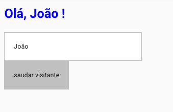
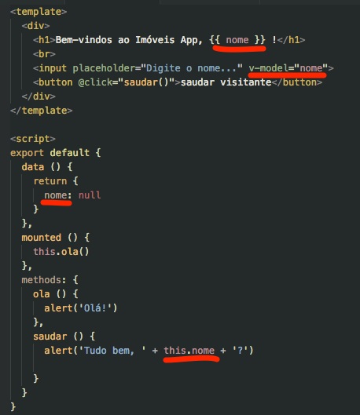

# Sintaxe

## Single File Components

Os componentes Vue ajudam a estender os elementos HTML para encapsular código de forma reusável. Todo código necessário para implementação é autocontido em um mesmo arquivo com extensão `.vue` \(Single File Components \).

```vue
<template>
  ... codigo html/css ...
</template>

<script>
  ... implementação do comportamento ...
</script>

<style scoped>
  ... estilo css/scss/less/stylus ...
</style>
```



```vue
<template>
  <div>

    <h1>Olá, {{ nome }} !</h1>

    <br>

    <input placeholder="Digite o nome..." v-model="nome">

    <button @click="saudar()">saudar visitante</button>

  </div>
</template>

<script>
export default {
  data () {
    return {
      nome: null
    }
  },
  mounted () {
    this.ola()
  },
  methods: {
    ola () {
      alert('Olá!')
    },
    saudar () {
      alert('Tudo bem, ' + this.nome + '?')

    }
  }
}
</script>

<style scoped>
  h1 {
    color: blue;
  }

  input {
    background: white;
    border: 1px solid #c0c0c0;
    padding: 20px;
    display: block;
    width: 300px;
  }

  button {
    border: 1px solid #c0c0c0;
    padding: 20px;
    background: #c0c0c0;
  }
</style>
```

O componente Vue possui um ciclo de vida específico, estrutura e métodos especiais utilizados na sua inicialização.

Ao ser inicializado, automaticamente o método `mounted()` é chamado, executando as tarefas inicias do componente.

```js
mounted() {
    this.ola()
}
```

Na seção `methods` são declarados os métodos os personalizados :

```js
ola() {
    alert('Olá!')
}
```

O método especial `data()` define o estado inicial dos atributos do componente, retornando um objeto. Neste caso `nome` inicialmente é vazio.

```js
data()
{
    return {
      nome: null
    }
}
```

O mesmo atributo `nome` é interligado automaticamente ao `input` através da diretiva `v-model` :

```html
<input placeholder="Digite o nome..." v-model="nome">
```

O Vue é **reativo**, portanto as declarações dos atributos no método `data()` refletem imediatamente no template, quando um valor é digitado no `input` .

```html
<h1>Olá, {{ nome }} !</h1>
```

Os elementos html podem ser complementados com outras diretivas especiais, como eventos de clique, por exemplo:

```html
<button @click="saudar()">saudar visitante</button>
```

Aqui `this.nome` é a mesma proriedade declarada em `data()` que é a mesma interligada no input com `v-model` :

```js
saudar() {
    alert('Tudo bem, ' + this.nome + '?')
}
```



Por fim, são declarados os estilos específicos para este componente. Note que é possível definir estilos globalmente.

```vue
<style scoped>
  h1 {
    color: blue;
  }

  input {
    background: white;
    border: 1px solid #c0c0c0;
    padding: 20px;
    display: block;
    width: 300px;
  }

  button {
    border: 1px solid #c0c0c0;
    padding: 20px;
    background: #c0c0c0;
  }
</style>
```

### Um pouco de estilo


Usando o **Vuetify** eliminamos a necessidade de código CSS personalizado, matendo o mesmo comportamento original do exemplo anterior. Remova todo o bloco `<style>` do componente e substitua os elementos html `input` e `button` por componentes do Vuetify:

```html
<v-text-field placeholder="Digite o nome" prepend-icon="account_box" v-model="nome"></v-text-field>

<v-btn color="info" @click="saudar()">
  <v-icon left>mode_comment</v-icon>
  saudar visitante
</v-btn>
```

## Condicionais

A diretiva `v-if` determina se o elemento html será visível.

```vue
<template>
  <div>
    <h1>{{ nome }} tem {{ idade }} anos!</h1>
    <br>
    <button @click="aniversario()">fazer aniversario</button>
    <br>
    <div v-if="idade > 25" class="destaque">Tem mais de 25 anos!</div>
  </div>
</template>

<script>
  export default {
    data () {
      return {
        nome: 'Maria',
        idade: 23,
      }
    },
    methods: {
      aniversario () {
        this.idade += 1
      }
    }
  }
</script>

<style scoped>
  button {
    border: 1px solid #c0c0c0;
    padding: 20px;
    background: gray;
    color: white;
  }

  .destaque {
    background: yellow;
    color: black;
    padding: 20px;
  }
</style>
```

## Loop

A diretiva `v-for` faz a iteração dos objetos. Em um `loop` é obrigatório que os elementos sejam identificados unicamente pelo atributo `:key` , neste caso utilizamos o `id` do filme iterado.

```vue
<template>
  <div>
    <h1>Filmes</h1>
    <br>
    <div v-for="filme in filmes" :key="filme.id">
      {{ filme.titulo }} ({{ filme.visualizacoes }})
    </div>
  </div>
</template>

<script>
  export default {
    data () {
      return {
        filmes: [
          {
            "id": 1,
            "titulo": "Star Wars",
            "visualizacoes": 2344
          },
          {
            "id": 2,
            "titulo": "Um sonho de liberdade",
            "visualizacoes": 1761
          },
        ]
      }
    }
  }
</script>

<style scoped>

</style>
```

Em um cenário real uma chamada ao backend seria realizada para trazer a relação de filmes. Inicialmente declaramos `filmes` como um array vazio, que sera preenchido em seguida pelos dados trazidos do backend.

```vue
<script>
  export default {
    data () {
      return {
        filmes: []
      }
    },
    mounted()
    {
      this.$axios.get('/filmes').then(response => {
        this.fimes = response.data
      })
    }    
  }
</script>
```

::: tip
Axios é a biblioteca usada para fazer requisições http \(ajax\) no backend.
:::