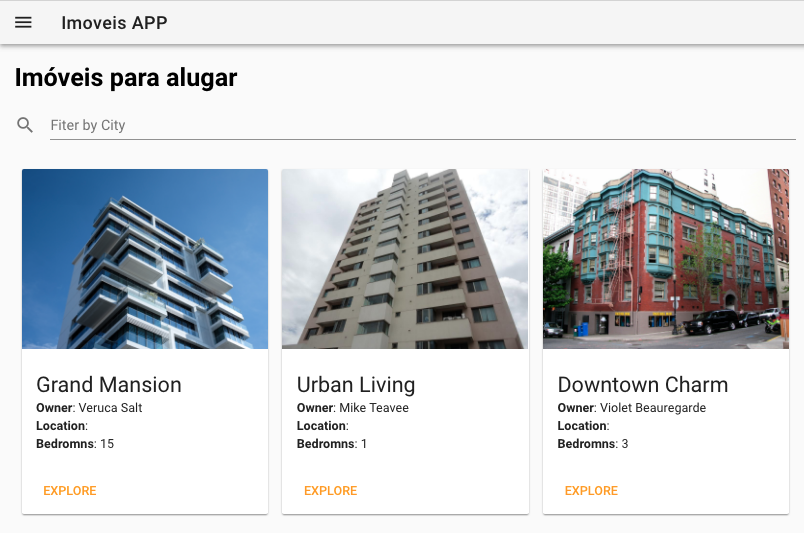

# Componentes estilizados

Mesmo utilizando Frameworks de CSS tradicionais o processo de estilizar os elementos de interface pode ser custoso. O **Vuetify** elmina parte da necessidade de escrever código html/css costumizado, uma vez que seus componentes abstraem este processo.



Primeiro, vamos alterar o template de `components/Imovel.vue` para utilizar o componente `v-card` do Vuetify.

```html
 <v-flex xs4 class="ma-2">
    <v-card>
      <v-card-media :src="imovel.image" height="200px">
      </v-card-media>
      <v-card-title primary-title>
        <div>
          <h3 class="headline mb-0">{{ imovel.title }}</h3>
          <div>
            <strong>Owner</strong>: {{ imovel.owner}} </div>
          <div>
            <strong>Location</strong>: {{ imovel.location}} </div>
          <div>
            <strong>Bedromns</strong>: {{ imovel.bedrooms}} </div>
        </div>
      </v-card-title>
      <v-card-actions>
        <v-btn flat color="orange">Explore</v-btn>
      </v-card-actions>
    </v-card>
  </v-flex>
```

Agora, na página `pages/imoveis.vue` vamos substir o `input` de pesquisa tradicional pelo componente  `v-text-field` do Vuetify. A lógica permanece a mesma, apenas trocamos o elemento de interface.

```html
<v-text-field label="Fiter by City" prepend-icon="search" v-model="termoPesquisa" @keyup="filtrar()"></v-text-field>
```

Adicionalmente, vamos envolver o componente "imovel" pela tag `v-layout`, para que os cards sejam acomodados corretamente.

```html
<v-layout>
    <imovel :imovel="meuImovel" v-for="meuImovel in imoveis" :key="meuImovel.id"></imovel>
</v-layout>
```

Assim, parte do trecho `<style></style>` da página e do componente podem ser eliminados, uma vez que passamos a utilizar componentes ao invés de html/css customizados.

::: tip 
 [https://vuetifyjs.com/en/components/cards](https://vuetifyjs.com/en/components/cards)

 [https://vuetifyjs.com/en/components/text-fields](https://vuetifyjs.com/en/components/text-fields)
::: 