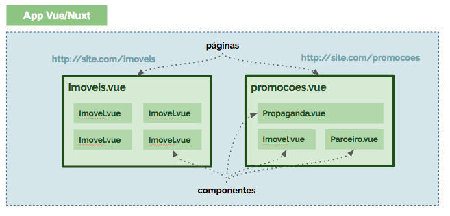

# Navegação

Um aplicativo construído com **Nuxt** é basicamente composto por **páginas** e **componentes**.

Uma página corresponde a uma rota/url acessível pelo navegador.  A página contém o setup inicial para preparar a exibição dos componentes contidos nesta. As páginas são **únicas** e **não são reutilizáveis**.

Os componentes implementam e encapsulam comportamentos específicos de uma aplicação. Os componentes são **desacoplados** e **reutilizáveis**.

## Rotas

O **Nuxt** abstrai as configurações manuais de rotas para as páginas. A convenção de estrutura de pastas e arquivos determina quais são as rotas de entrada da aplicação, gerando automaticamente as configurações necessárias.

A pasta `/pages` armazena as **páginas** de entrada da aplicação e define as rotas automaticamente, conforme padrão:

| Arquivo da página | Url | Descrição |
| :--- | :--- | :--- |
| /pages/index.vue | [http://localhost:3000](http://localhost:3000) | Página inicial da aplicação |
| /pages/imoveis.vue | [http://localhost:3000/imoveis](http://localhost:3000/imoveis) | Lista geral de imóveis |

Neste momento, vamos manter a estrutura simplificada acima. Em capítulos posteriores, modificaremos a aplicação para usar subrotas. Caso seja necessário definir subrotas, deve-se reformular a estrutura para:

| Arquivo da página | Url | Descrição |
| :--- | :--- | :--- |
| /pages/index.vue | [http://localhost:3000](http://localhost:3000) | Página inicial da aplicação |
| /pages/imoveis/index.vue | [http://localhost:3000/imoveis](http://localhost:3000/imoveis) | Lista de imóveis |
| /pages/imoveis/\_id.vue | [http://localhost:3000/imoveis/{id}](http://localhost:3000/imoveis/{id}) | Exibe um imóvel baseado no ID |

::: tip ROTAS
[https://nuxtjs.org/guide/routing](https://nuxtjs.org/guide/routing)
:::

