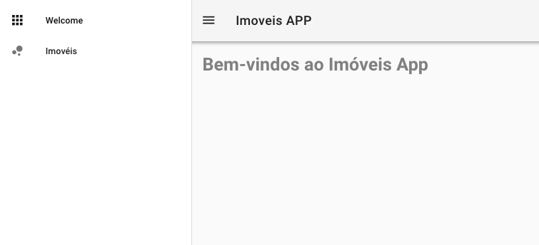

# Projeto

A aplicação "Imoveis APP" exibe imóveis para aluguel, sendo possível filtrar os imóveis por cidade.


## Preparando o exemplo

A instalação inicial traz algumas **páginas** e **componentes**. Vamos preparar uma estrutura inicial simplificada, que será abordada nos capítulos seguintes.Neste primeiro momento ignore o código.

**Substitua o conteúdo de **`layouts/default.vue`** por:**

```vue
<template>
  <v-app>
    <v-navigation-drawer v-model="drawer" fixed app>
      <v-list>
        <v-list-tile router exact to="/">
          <v-list-tile-action>
            <v-icon>apps</v-icon>
          </v-list-tile-action>
          <v-list-tile-content>
            <v-list-tile-title>Welcome</v-list-tile-title>
          </v-list-tile-content>
        </v-list-tile>
        <v-list-tile router exact to="/imoveis">
          <v-list-tile-action>
            <v-icon>bubble_chart</v-icon>
          </v-list-tile-action>
          <v-list-tile-content>
            <v-list-tile-title>Imóveis</v-list-tile-title>
          </v-list-tile-content>
        </v-list-tile>
      </v-list>
    </v-navigation-drawer>
    <v-toolbar fixed app>
      <v-toolbar-side-icon @click="drawer = !drawer"></v-toolbar-side-icon>
      <v-toolbar-title>Imoveis APP</v-toolbar-title>
    </v-toolbar>
    <v-content>
      <v-container>
        <nuxt />
      </v-container>
    </v-content>
  </v-app>
</template>

<script>
  export default {
    data () {
      return {
        drawer: true
      }
    }
  }
</script>
```

Substitua o conteúdo de `pages/index.vue` por:

```vue
<template>
  <div>
    <h1>Bem-vindos ao Imóveis App</h1>
  </div>
</template>

<script>
  export default {

  }
</script>

<style scoped>
  h1 {
    color: gray;
  }
</style>
```

Renomeie o arquivo `pages/inspire.vue` para `pages/imoveis.vue` e substitua seu conteúdo por:

```vue
<template>
  <div>
    <h1>Imóveis para alugar</h1>
  </div>
</template>

<script>
  export default {

  }
</script>

<style scoped>
  h1 {
    color: blue;
  }
</style>
```

Apague os componentes `components/Logo.vue` e `components/VuetifyLogo.vue` e navegue novamente para [http://localhost:3000](http://localhost:3000) para ver o projeto atualizado:



Nos capítulos seguintes serão detalhadas as tecnologias, componentes, sintaxe, configurações e estruturas de pastas dos frameworks utilizados.

